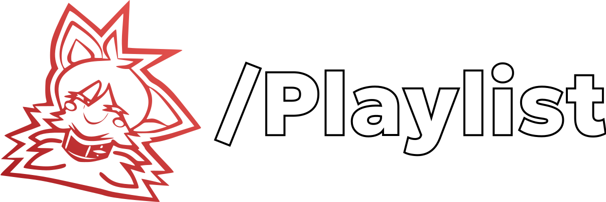

    

<h4 align="center">
A web extension & program to sync YT playlists into directories on your disk.
</h4>

This repo is split between two projects:

- `src/extension` - A React web extension, built with webpack.
- `src/program` - A Rust program, used as a local webserver to run yt-dlp.

## Features
- 🧩 Trigger the download in-browser for all playlists starting with a "/"
- 📥 Download only the missing files to your disk
- 📤 Remove files that are no longer in the playlist
- 🚅 Download up to 10 videos concurrently
- 📛 Rename downloaded files to anything you want
- 📁 Unlimited nested directory support via playlist name

## Installation / Usage
The web extension will fetch all playlists from Youtube that have a title starting with a "/" (ex: "/Mood/Jamming") and send it to the program to download into directories.

0. Have [ffmpeg](https://ffmpeg.org/) and [yt-dlp](https://github.com/yt-dlp/yt-dlp) installed on your PATH.
1. Download the Chrome/Firefox extension and executable [here](https://github.com/Sukadia/Slash-Playlist/releases/latest).
2. Install the web extension. Open it, and paste in your Download Directory path. (ex: "X:\Some Useful Stuff\Music\Stream")
3. Run `slash-playlist.exe`.
4. Navigate to https://www.youtube.com/feed/playlists. Press Fetch and Download in the extension.
5. Monitor the `slash-playlist.exe` prompt to see download progress.

## Development
Use `npm run extension-build` and `npm run program-build` to build each project.